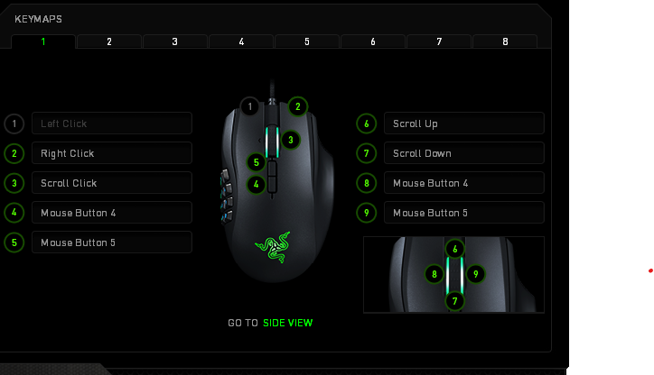
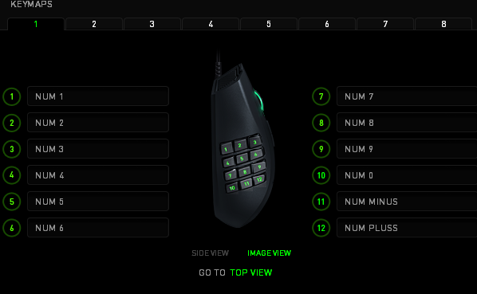

# Razer settings

This repo contains two setting files.

[NAGA-WOW.RazerSynapse](NAGA-WOW.RazerSynapse) is the settings for the previous razer synapse software which support the first generations of Razer BlackWidows and Razer Naga.

[TRINITY-SETTINGS.synapse3](TRINITY-SETTINGS.synapse3) is the settings for the new Razer Synapse software which currently (as of february 2021) is still in beta. The Razer Trinity settings are similar to the previous Razer Naga settings which are seen in the images below.

> Important! The current setting for the Razer Naga is polling rate at _1000 hz_ and dpi at _1350_.

## Overview over Razer Naga settings

### Topview

### Sideview

